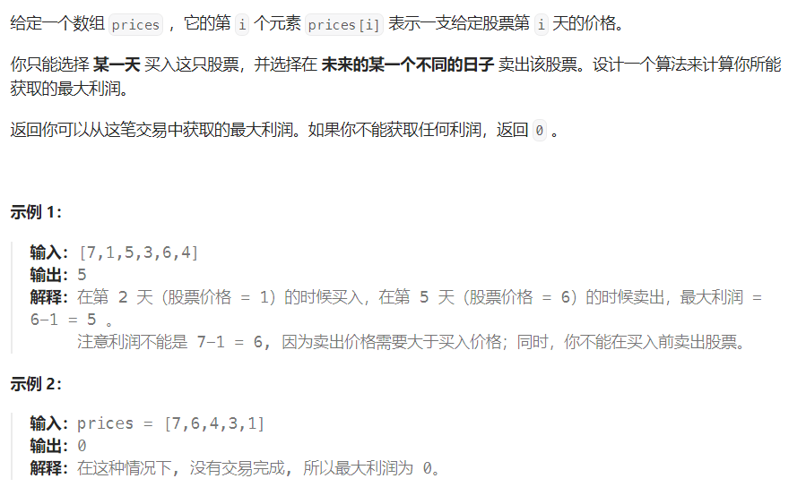
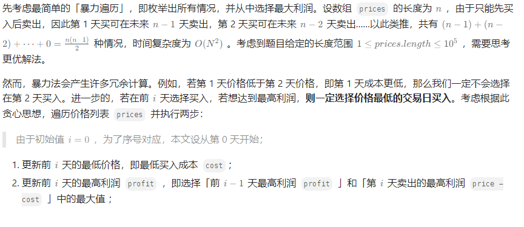
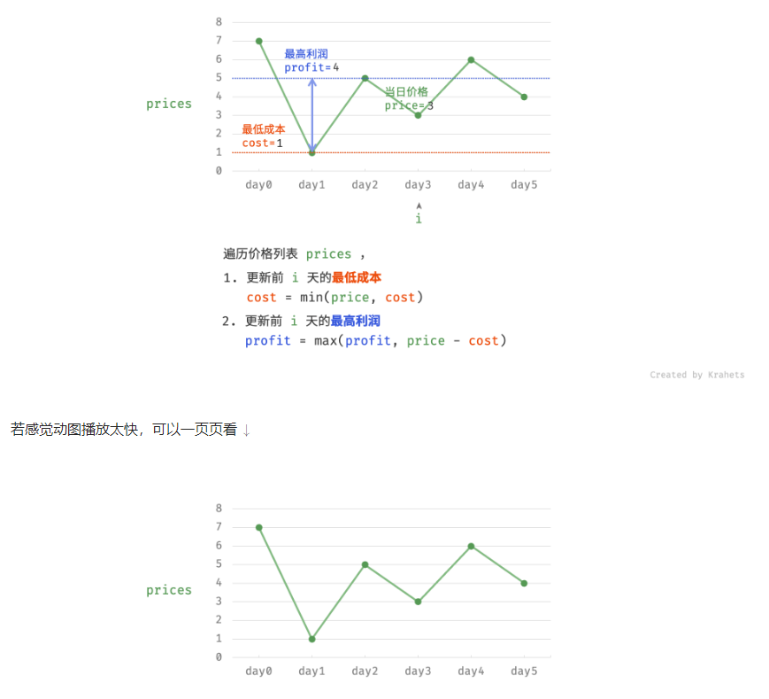

## 121.买卖股票的最佳时机

### 题目描述



### 解题思路





### 参考代码

```java
class Solution {
    public int maxProfit(int[] prices) {
        int maxProfit = 0;
        int minPrice = Integer.MAX_VALUE;

        for (int price : prices) {
            minPrice = Math.min(price, minPrice);
            maxProfit = Math.max(maxProfit, price - minPrice);
        }

        return maxProfit;

    }
}
```

