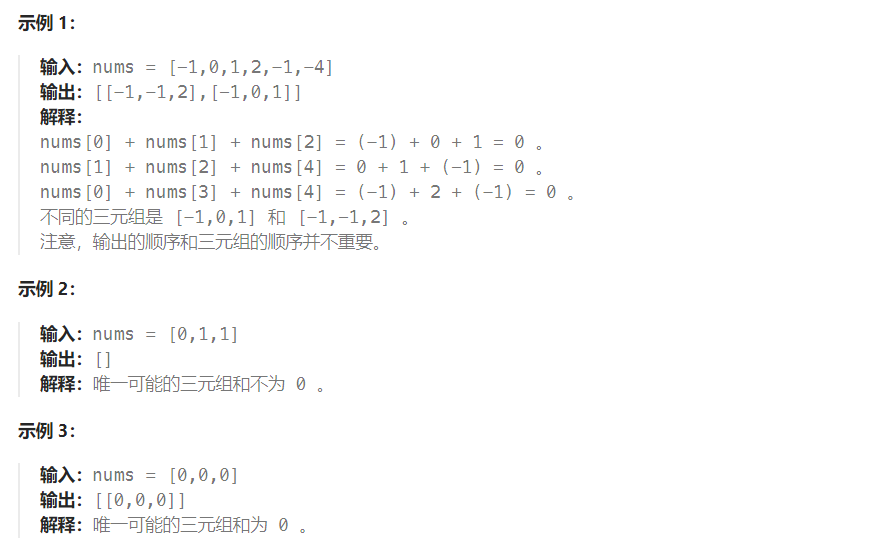

# 三数之和

## 题目描述




## 解题思路


## 参考代码

```java
class Solution {
    //定义三个指针，保证遍历数组中的每一个结果
    //画图，解答
    public List<List<Integer>> threeSum(int[] nums) {
        //定义一个结果集
        List<List<Integer>> res = new ArrayList<>();
        //数组的长度
        int len = nums.length;
        //将数组进行排序
        Arrays.sort(nums);
        //遍历数组中的每一个元素
        for(int i = 0; i<len;i++){
            //如果遍历的起始元素大于0，就直接退出
            //原因，此时数组为有序的数组，最小的数都大于0了，三数之和肯定大于0
            if(nums[i]>0){
                break;
            }
            //去重，当起始的值等于前一个元素，那么得到的结果将会和前一次相同
            if(i > 0 && nums[i] == nums[i-1]) continue;
            int l = i +1;
            int r = len-1;
            //当 l 不等于 r时就继续遍历
            while(l<r){
                //将三数进行相加
                int sum = nums[i] + nums[l] + nums[r];
                //如果等于0，将结果对应的索引位置的值加入结果集中
                if(sum==0){
                    // 将三数的结果集加入到结果集中
                    res.add(Arrays.asList(nums[i], nums[l], nums[r]));
                    //在将左指针和右指针移动的时候，先对左右指针的值，进行判断
                    //如果重复，直接跳过。
                    //去重，因为 i 不变，当此时 l取的数的值与前一个数相同，所以不用在计算，直接跳
                    while(l < r && nums[l] == nums[l+1]) {
                        l++;
                    }
                    //去重，因为 i不变，当此时 r 取的数的值与前一个相同，所以不用在计算
                    while(l< r && nums[r] == nums[r-1]){
                        r--;
                    } 
                    //将 左指针右移，将右指针左移。
                    l++;
                    r--;
                    //如果结果小于0，将左指针右移
                }else if(sum < 0){
                    l++;
                    //如果结果大于0，将右指针左移
                }else if(sum > 0){
                    r--;
                }
            }
        }
        return res;
    }
}
```

