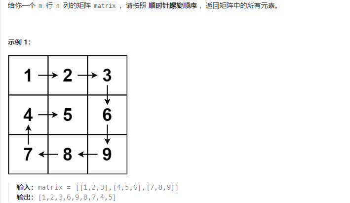
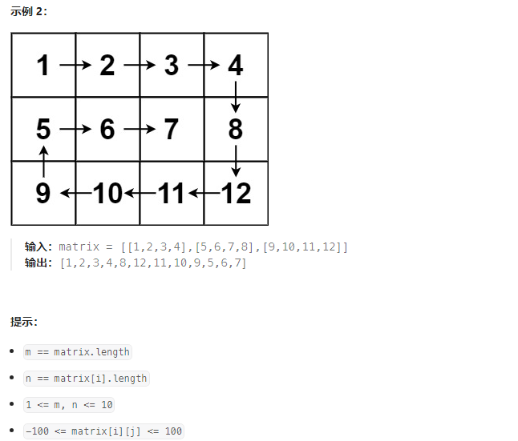
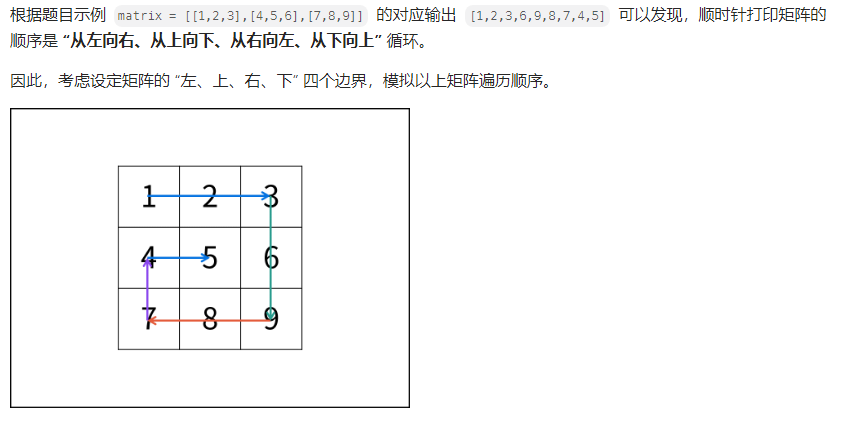
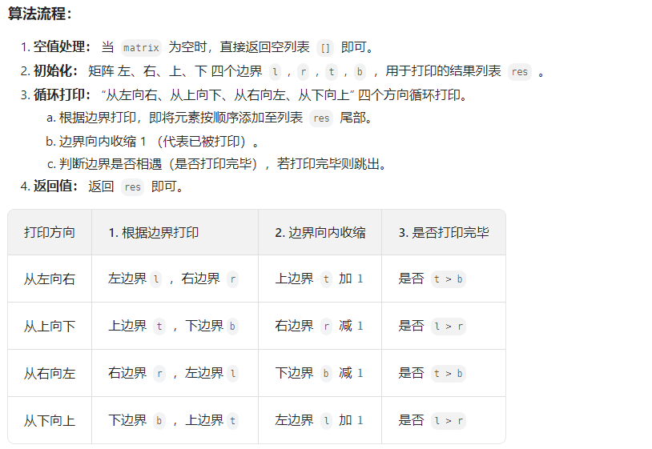

## 54. 螺旋矩阵

### 题目描述





### 解题思路





### 参考代码

```java
class Solution {
    public List<Integer> spiralOrder(int[][] matrix) {
        if (matrix.length == 0) return new ArrayList<Integer>();
        int left = 0, right = matrix[0].length -1, top = 0, bottom = matrix.length  - 1, x = 0;
        Integer[] res = new Integer[(r+1) * (b+1)];
        while (true) {
            // 第一步：从左边往右遍历
            for (int i = left; i < right; i ++) res[x++] = matrix[top][i];// line top, left to right
            if (++top > bottom) break;// 下一步，从上到下，边界条件：判断是否还需要执行

            for (int i = top; i <= bottom; i++) res[x++] = matrix[i][right];// column right, top to bottom
            if (left > --right) break;


        }

    }
}
```

